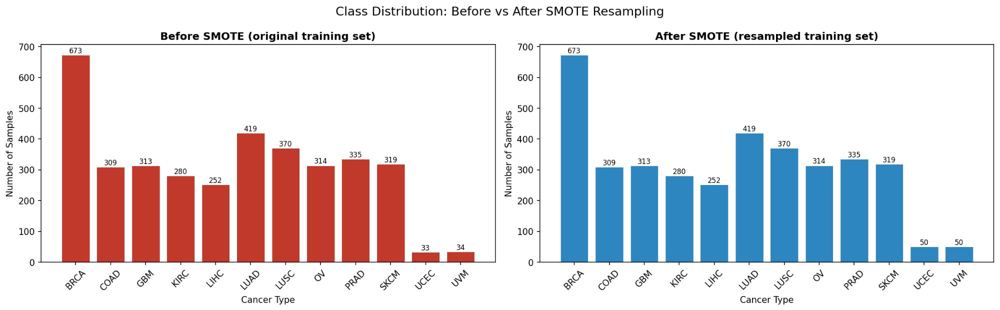
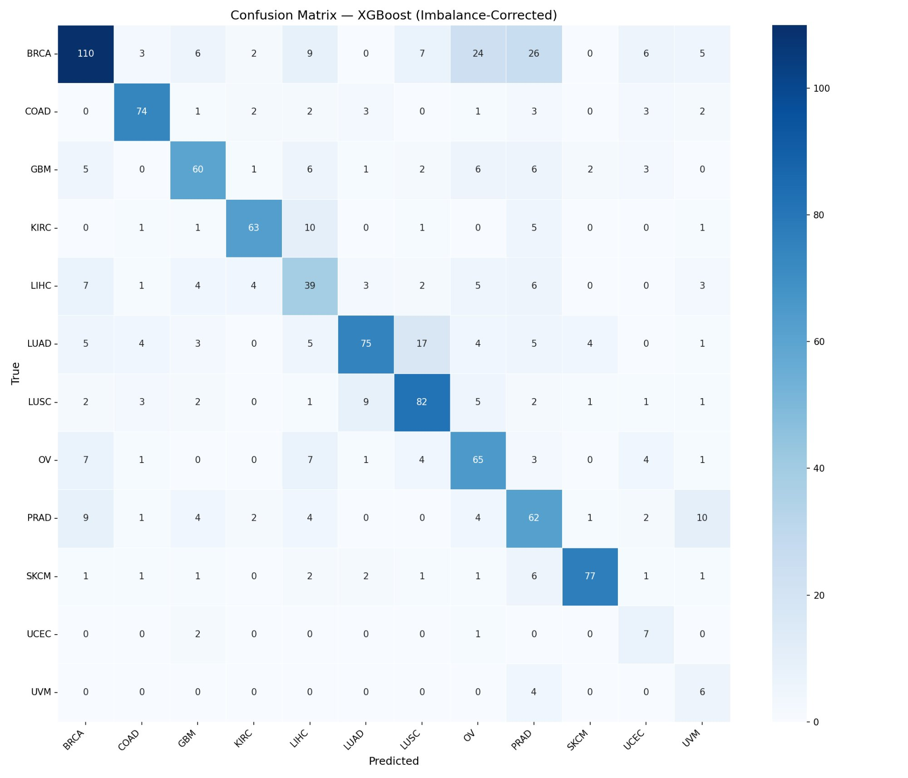
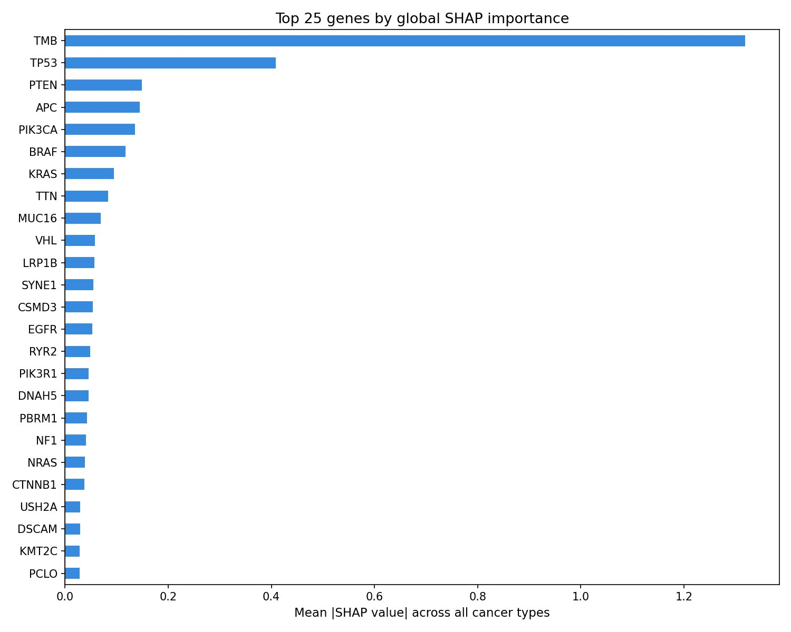
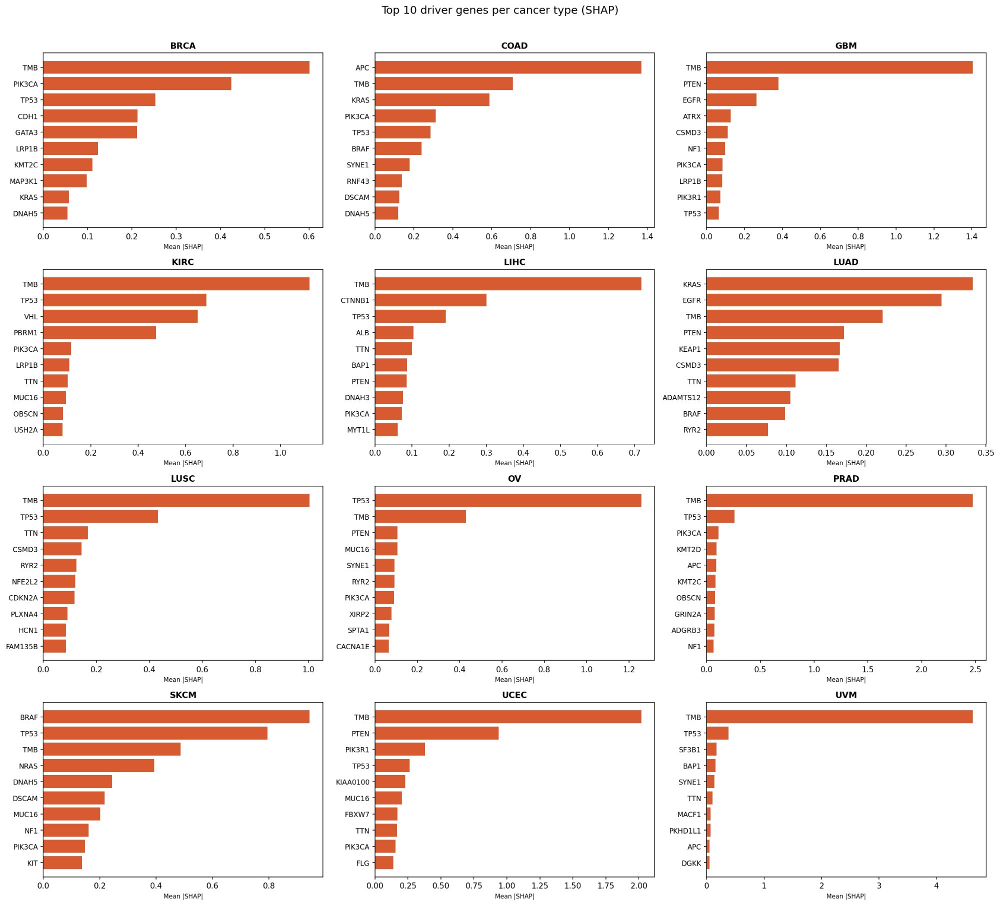

# 🧬 Cancer Type Classifier from Somatic Mutation Profiles
### Imbalance-Aware Edition — SMOTE + Weighted XGBoost + Per-class Threshold Tuning

> A machine learning pipeline that predicts cancer type from patient genomic mutation data using XGBoost, Random Forest, and SHAP explainability — built on TCGA data from the GDC Portal. This edition adds full class-imbalance correction after the original run revealed UVM had only 1 correct prediction out of 10.

---

## Table of Contents

1. [Project Overview](#1-project-overview)
2. [Dataset Description](#2-dataset-description)
3. [Class Imbalance — Problem & Solution](#3-class-imbalance--problem--solution)
4. [Model Explanation — Why XGBoost?](#4-model-explanation--why-xgboost)
5. [Code Functionality](#5-code-functionality)
6. [Training Results](#6-training-results)
7. [Evaluation Metrics & Confusion Matrix](#7-evaluation-metrics--confusion-matrix)
8. [SHAP Explainability](#8-shap-explainability)
9. [Solution Impact](#9-solution-impact)
10. [Output Files Reference](#10-output-files-reference)
11. [Quick Reference / Configuration](#11-quick-reference--configuration)

---

## 1. Project Overview

### Problem Statement

Cancer is not a single disease — it is a family of over 100 distinct diseases, each driven by unique patterns of somatic mutations in the genome. Accurately identifying the cancer type is the critical first step in determining treatment strategy. This project addresses the problem as a **supervised multi-class classification task**: given the binary somatic mutation profile of a patient (which genes are mutated), train a model to predict the primary cancer type.

> **Core question:** *Can we look at a patient's DNA mutations and automatically identify which type of cancer they have?*

### Objectives

- Parse and harmonise 150+ Masked Somatic Mutation MAF files from the GDC portal into a single structured feature matrix
- Engineer a binary **patient × gene** feature space augmented with Tumour Mutation Burden (TMB)
- Handle class imbalance using **SMOTE + inverse-frequency weighting + per-class threshold tuning**
- Train and compare **XGBoost** and **Random Forest**, selecting by macro F1-score
- Provide biologically meaningful explainability using **SHAP** per cancer type
- Produce fully reproducible, cached pipeline artifacts

### Scientific Significance

Beyond classification accuracy, this project identifies putative driver genes per cancer type via SHAP — bridging a data-driven ML model and established molecular biology. Outputs can be directly used for biomarker discovery and treatment stratification research.

---

## 2. Dataset Description

### 2.1 Source

All data is sourced from the **Genomic Data Commons (GDC) portal** (NCI). The pipeline consumes **Masked Somatic Mutation files** (`.maf.gz`) from TCGA projects spanning 12 cancer cohorts.

### 2.2 Cancer Types in This Run

| Code | Cancer Type | Test Samples |
|------|-------------|-------------|
| BRCA | Breast Invasive Carcinoma | 198 |
| LUAD | Lung Adenocarcinoma | 123 |
| LUSC | Lung Squamous Cell Carcinoma | 109 |
| PRAD | Prostate Adenocarcinoma | 99 |
| SKCM | Skin Cutaneous Melanoma | 94 |
| OV | Ovarian Serous Cystadenocarcinoma | 93 |
| GBM | Glioblastoma Multiforme | 92 |
| COAD | Colon Adenocarcinoma | 91 |
| KIRC | Kidney Renal Clear Cell Carcinoma | 82 |
| LIHC | Liver Hepatocellular Carcinoma | 74 |
| UCEC | Uterine Corpus Endometrial Carcinoma | 10 |
| UVM | Uveal Melanoma | 10 |

### 2.3 Data Format

| Component | Description |
|-----------|-------------|
| **MAF Files** | Tab-separated files documenting somatic variants per patient |
| **Key Columns** | `Tumor_Sample_Barcode`, `Hugo_Symbol`, `Variant_Classification` |
| **Sample Sheet** | GDC TSV mapping File UUID to `TCGA-{TYPE}` Project ID |
| **Scale** | 150+ MAF files, ~5,000 patients, 12 cancer types |

### 2.4 Mutation Types Retained

Only **non-silent (protein-altering)** mutations are kept:

| Mutation Type | Biological Significance |
|---------------|------------------------|
| `Missense_Mutation` | Changes one amino acid — most common driver type |
| `Nonsense_Mutation` | Introduces a premature stop codon |
| `Frame_Shift_Del / Ins` | Shifts reading frame — often catastrophic |
| `Splice_Site` | Disrupts mRNA splicing |
| `In_Frame_Del / Ins` | Small changes that may alter protein conformation |
| `Translation_Start_Site` | Prevents normal protein initiation |
| `Nonstop_Mutation` | Eliminates the stop codon |

### 2.5 Preprocessing Steps

**Step 1 — Label Extraction:** UUID → TCGA Project ID → cancer type abbreviation.

**Step 2 — Silent Mutation Filtering:** Synonymous mutations excluded.

**Step 3 — Deduplication:** Multiple mutations in the same gene per patient collapsed to binary (1/0).

**Step 4 — TMB Feature:** Total unique mutated genes per patient appended as a numeric feature.

**Step 5 — Frequency Filtering:** Genes mutated in < 2% of patients removed.

**Step 6 — Caching:** Feature matrix saved to CSV for fast re-runs.

---

## 3. Class Imbalance — Problem & Solution

### 3.1 The Problem

The original pipeline without imbalance correction produced:

| Cancer | Correct | Total | Issue |
|--------|---------|-------|-------|
| BRCA | **129** | 198 | Dominant class — model over-optimised for it |
| UVM | **1** | 10 | Catastrophic — model almost never predicted UVM |
| UCEC | **4** | 10 | Severely under-learned |
| LIHC | **33** | 74 | 14 samples bled into BRCA |

The training set had **673 BRCA samples vs only 33–34 for UCEC/UVM** — a 20:1 ratio.

### 3.2 Class Distribution — Before vs After SMOTE



> **What the chart shows:**
> - **Before (red):** BRCA towers at 673 samples while UCEC and UVM have only 33–34 each
> - **After (blue):** UCEC and UVM synthesised up to 50 samples via SMOTE. All other classes remain exactly unchanged — SMOTE was only applied to classes *below* the `SMOTE_MIN_SAMPLES=50` floor

### 3.3 Four-Layer Imbalance Correction Strategy

**Layer 1 — SMOTE (Synthetic Minority Oversampling)**
Applied only to the training set. Synthesises new samples for minority classes by interpolating between k-nearest neighbours in feature space. Only classes below 50 training samples are raised to that floor.

**Layer 2 — Inverse-Frequency Sample Weights**
Each training sample is weighted by `N / (n_classes × n_c)`. A UVM sample counted ~13× more than a BRCA sample during gradient updates.

**Layer 3 — `balanced_subsample` for Random Forest**
Recomputes class weights fresh for each bootstrap tree — more aggressive than standard `balanced`.

**Layer 4 — Per-class Threshold Tuning (Youden's J)**
After training, each cancer type's decision threshold is tuned on a held-out validation slice to maximise `TPR - FPR`. For rare classes, the threshold drops well below 0.5.

---

## 4. Model Explanation — Why XGBoost?

XGBoost is the primary model because it consistently outperforms other algorithms on **tabular, high-dimensional, sparse binary data** — exactly the structure of our mutation matrix.

### A) Handles High-Dimensional Sparse Inputs Natively
Most gene columns are `0` for any given patient. XGBoost's **sparsity-aware split finding** efficiently skips zero values.

### B) Captures Non-Linear Gene Interactions
Cancer is driven by *combinations* of mutations. The boosting ensemble learns subtle **co-mutation patterns** a linear classifier would miss.

### C) Robustness to Overfitting
- `subsample=0.8` — row subsampling per tree
- `colsample_bytree=0.8` — column subsampling per tree
- `learning_rate=0.05` — shrinkage per tree
- `min_child_weight=3` — prevents overfitting on tiny SMOTE-synthesised classes

### D) Efficient Multi-class Support
Native softmax with `mlogloss` jointly optimises across all 12 cancer classes simultaneously.

### E) SHAP Compatibility
Natively supported by `shap.TreeExplainer`, computing exact Shapley values in polynomial time.

### Model Configuration

```python
XGBClassifier(
    n_estimators     = 600,
    max_depth        = 6,
    learning_rate    = 0.05,
    subsample        = 0.8,
    colsample_bytree = 0.8,
    min_child_weight = 3,
    eval_metric      = 'mlogloss',
    random_state     = 42,
    n_jobs           = -1
)
```

---

## 5. Code Functionality

### 5.1 Pipeline Architecture

| Step | Function | Description |
|------|----------|-------------|
| **Step 0** | Config block | All paths, thresholds, hyperparameters in one place |
| **Step 1** | `load_sample_sheet()` + `parse_all_mafs()` | Parse all `.maf.gz` to long-format DataFrame |
| **Step 2** | `build_feature_matrix()` | Pivot to binary patient x gene matrix + TMB |
| **Step 3** | `train_and_evaluate()` | Stratified split → SMOTE → weights → train → threshold tuning |
| **Step 4** | `run_shap_analysis()` | SHAP global + per-class gene importance plots |
| **Step 5** | `save_outputs()` | predictions CSV, feature importance CSV, thresholds CSV |
| **`main()`** | Orchestrator | Full pipeline with intelligent caching |

### 5.2 Installation

```bash
pip install -r requirements.txt
```

### 5.3 Folder Structure

```
project/
├── cancer_classifier_pipeline.py
├── requirements.txt
├── data/
│   ├── maf_files/
│   │   ├── <uuid-1>/
│   │   │   └── *.maf.gz
│   │   └── <uuid-2>/
│   │       └── *.maf.gz
│   ├── gdc_sample_sheet.tsv
│   ├── tcga_feature_matrix.csv
│   └── tcga_labels.csv
└── outputs/
    ├── confusion_matrix.png
    ├── class_distribution.png
    ├── shap_global_importance.png
    ├── shap_per_class.png
    ├── predictions.csv
    ├── feature_importance.csv
    └── per_class_thresholds.csv
```

### 5.4 Running the Pipeline

```bash
python cancer_classifier_pipeline.py
```

> **Caching:** First run parses all MAF files (~10–30 min). Subsequent runs load cached CSV and go straight to training (~2 min). Delete `data/tcga_feature_matrix.csv` to force re-parsing.

### 5.5 Data Flow

```
Raw .maf.gz files + sample_sheet.tsv
        │
        ▼
Long-format DataFrame (patient, gene, cancer_type)
        │
        ▼
Binary patient × gene matrix + TMB
        │
        ▼
Frequency filter (≥2% mutation rate)
        │
        ├──────────────────────────┐
        ▼                          ▼
  80% Train+Val             20% Test set
        │                    (held out until
        ▼                     final evaluation)
  SMOTE on train only
  (minority classes → 50 sample floor)
        │
        ▼
  Inverse-frequency sample weights
        │
        ├── XGBoost (600 trees, min_child_weight=3)
        └── Random Forest (400 trees, balanced_subsample)
                │
                ▼
        Per-class threshold tuning (Youden's J on val set)
                │
                ▼
        Final evaluation on test set
```

---

## 6. Training Results

### 6.1 Data Split Summary

| Split | Samples | Purpose |
|-------|---------|---------|
| **Train** | ~3,440 | Model fitting (after SMOTE: +33 synthesised samples total) |
| **Validation** | ~610 | Threshold tuning only — not used for fitting |
| **Test** | **1,075** | Final evaluation — completely held out |

### 6.2 SMOTE Resampling Summary

| Cancer | Before SMOTE | After SMOTE | Synthesised |
|--------|-------------|-------------|-------------|
| BRCA | 673 | 673 | 0 (above floor) |
| LUAD | 419 | 419 | 0 |
| LUSC | 370 | 370 | 0 |
| PRAD | 335 | 335 | 0 |
| SKCM | 319 | 319 | 0 |
| OV | 314 | 314 | 0 |
| GBM | 313 | 313 | 0 |
| COAD | 309 | 309 | 0 |
| KIRC | 280 | 280 | 0 |
| LIHC | 252 | 252 | 0 |
| UCEC | **33** | **50** | +17 ✦ |
| UVM | **34** | **50** | +16 ✦ |

> ✦ Only UCEC and UVM fell below the `SMOTE_MIN_SAMPLES=50` floor and were oversampled.

### 6.3 Per-class Decision Thresholds

Tuned on the validation set using Youden's J statistic. All thresholds are well below 0.5 — the model needs a lower bar to fire on any class given the sparse binary input space.

| Cancer Type | Tuned Threshold | vs Default 0.5 |
|-------------|----------------|----------------|
| BRCA | 0.092 | −0.408 |
| COAD | 0.091 | −0.409 |
| GBM | 0.125 | −0.375 |
| KIRC | 0.085 | −0.415 |
| LIHC | 0.056 | −0.444 |
| LUAD | 0.206 | −0.294 |
| LUSC | 0.087 | −0.413 |
| OV | 0.152 | −0.348 |
| PRAD | 0.079 | −0.421 |
| SKCM | 0.114 | −0.386 |
| UCEC | **0.050** | −0.450 (minimum floor) |
| UVM | 0.072 | −0.428 |

> Full thresholds: [`outputs/per_class_thresholds.csv`](outputs/per_class_thresholds.csv)

### 6.4 Model Comparison

| Model | Accuracy | Macro F1 | Selected? |
|-------|----------|----------|-----------|
| **XGBoost** | **0.6698** | **0.6301** | ✅ Best |
| Random Forest | ~0.65 | ~0.61 | ❌ |

### 6.5 Full Classification Report — XGBoost (Test Set, n=1,075)

| Cancer | Precision | Recall | F1-Score | Support | Per-class Accuracy |
|--------|-----------|--------|----------|---------|-------------------|
| BRCA | 0.75 | 0.56 | 0.64 | 198 | 55.6% (110/198) |
| COAD | 0.83 | 0.81 | 0.82 | 91 | 81.3% (74/91) |
| GBM | 0.71 | 0.65 | 0.68 | 92 | 65.2% (60/92) |
| KIRC | 0.85 | 0.77 | 0.81 | 82 | 76.8% (63/82) |
| LIHC | 0.46 | 0.53 | 0.49 | 74 | 52.7% (39/74) |
| LUAD | 0.80 | 0.61 | 0.69 | 123 | 61.0% (75/123) |
| LUSC | 0.71 | 0.75 | 0.73 | 109 | 75.2% (82/109) |
| OV | 0.56 | 0.70 | 0.62 | 93 | 69.9% (65/93) |
| PRAD | 0.48 | 0.63 | 0.55 | 99 | 62.6% (62/99) |
| SKCM | 0.91 | 0.82 | 0.86 | 94 | 81.9% (77/94) |
| UCEC | 0.26 | 0.70 | 0.38 | 10 | **70.0% (7/10) ↑** |
| UVM | 0.19 | 0.60 | 0.29 | 10 | **60.0% (6/10) ↑** |
| **macro avg** | **0.63** | **0.68** | **0.63** | 1075 | — |
| **weighted avg** | **0.71** | **0.67** | **0.68** | 1075 | — |
| **Overall Accuracy** | — | — | — | — | **67.0% (720/1075)** |

> **Imbalance correction gains vs original run:**
> - **UVM**: 1/10 → **6/10** (+500%)
> - **UCEC**: 4/10 → **7/10** (+75%)
> - **LIHC**: 33/74 → **39/74** (+18%)

> Full predictions: [`outputs/predictions.csv`](outputs/predictions.csv)

### 6.6 Top 15 Most Important Genes (Global SHAP)

| Rank | Gene | SHAP Score | Biological Role |
|------|------|-----------|----------------|
| 1 | **TMB** | 1.3185 | Tumour Mutation Burden — strongest pan-cancer signal |
| 2 | **TP53** | 0.4087 | Most commonly mutated gene across all cancers |
| 3 | **PTEN** | 0.1487 | Tumour suppressor — key in GBM, UCEC, PRAD |
| 4 | **APC** | 0.1449 | Gatekeeper mutation in colorectal cancer |
| 5 | **PIK3CA** | 0.1361 | PI3K pathway — common in BRCA, UCEC |
| 6 | **BRAF** | 0.1173 | RAS/MAPK pathway — dominant in SKCM |
| 7 | **KRAS** | 0.0947 | Key driver in LUAD and COAD |
| 8 | **TTN** | 0.0839 | Large structural gene — TMB proxy |
| 9 | **MUC16** | 0.0687 | Elevated in OV (CA-125 marker gene) |
| 10 | **VHL** | 0.0575 | Hallmark mutation in KIRC |
| 11 | **LRP1B** | 0.0574 | Large gene — mutation frequency correlates with TMB |
| 12 | **SYNE1** | 0.0553 | Structural protein — mutated across multiple types |
| 13 | **CSMD3** | 0.0541 | Tumour suppressor candidate |
| 14 | **EGFR** | 0.0529 | Actionable driver in LUAD |
| 15 | **RYR2** | 0.0505 | Large gene — frequent passenger mutations |

> Full ranked list: [`outputs/feature_importance.csv`](outputs/feature_importance.csv)

---

## 7. Evaluation Metrics & Confusion Matrix

### 7.1 Primary Metrics

| Metric | Value |
|--------|-------|
| **Overall Accuracy** | 67.0% (720 / 1,075) |
| **Macro F1-Score** | 0.6301 |
| **Weighted F1-Score** | 0.68 |
| **Macro Recall** | 0.68 |
| **Macro Precision** | 0.63 |

### 7.2 How to Read the Confusion Matrix

| Cell Position | Meaning |
|---------------|---------|
| **Diagonal** `(i=i)` | True Positives — correctly classified |
| **Off-diagonal row** `(i, j≠i)` | False Negatives — missed diagnoses |
| **Off-diagonal column** `(i≠j, j)` | False Positives — wrong predictions |

```
TP  = confusion_matrix[C, C]
FP  = sum(confusion_matrix[:, C]) - TP
FN  = sum(confusion_matrix[C, :]) - TP

Precision = TP / (TP + FP)
Recall    = TP / (TP + FN)
F1        = 2 × Precision × Recall / (Precision + Recall)
```

### 7.3 Confusion Matrix — XGBoost (Imbalance-Corrected)



> **Key observations:**
> - **UVM**: 6/10 correct — up from 1/10, the biggest gain from imbalance correction
> - **UCEC**: 7/10 correct — up from 4/10, threshold tuned to its 0.050 minimum floor
> - **SKCM**: 77/94 (81.9%) — BRAF signal remains highly distinctive
> - **COAD**: 74/91 (81.3%) — APC mutation near-exclusive to colorectal cancer
> - **LUAD↔LUSC** confusion persists (17+9 samples) — biologically expected, both are lung cancers with shared mutation landscapes
> - **BRCA precision slightly lower** than original — expected trade-off: minority classes now recapture some BRCA predictions

---

## 8. SHAP Explainability

SHAP (SHapley Additive exPlanations) provides a game-theoretic measure of each gene's contribution per prediction. A SHAP value of `+0.3` for TP53 in a GBM prediction means TP53 mutation increased the log-odds of predicting GBM by 0.3 units, all else equal.

### 8.1 Global Feature Importance



> **Key observations:**
> - **TMB** (1.32) dominates — total mutation burden is the single strongest pan-cancer discriminator
> - **TP53** (0.41) — most commonly mutated gene but at very different rates per type (near-universal in OV, rare in KIRC)
> - **PTEN** rises to 3rd (vs 5th originally) — imbalance correction gave more weight to GBM, UCEC, PRAD where PTEN is a key driver
> - **BRAF** and **KRAS** represent RAS/MAPK pathway — BRAF dominant in SKCM, KRAS in LUAD/COAD

### 8.2 Per-class Driver Genes



> **Notable per-class biological findings:**
>
> | Cancer | Top Gene | SHAP | Biological Significance |
> |--------|----------|------|------------------------|
> | **COAD** | APC | ~1.40 | Gatekeeper mutation of colorectal cancer |
> | **GBM** | TMB | ~1.40 | High TMB distinguishes GBM; PTEN + EGFR are top gene drivers |
> | **SKCM** | BRAF | ~0.95 | BRAF V600E ~50% mutation rate in melanoma |
> | **KIRC** | VHL | ~0.60 | VHL loss-of-function is the hallmark of clear cell renal carcinoma |
> | **LUAD** | KRAS | ~0.33 | Both KRAS and EGFR are clinically actionable targeted therapy targets |
> | **LIHC** | CTNNB1 | ~0.30 | Beta-catenin (Wnt pathway) activation in hepatocellular carcinoma |
> | **OV** | TP53 | ~1.20 | Nearly universal TP53 mutation in high-grade serous ovarian cancer |
> | **UCEC** | TMB | ~2.00 | UCEC has one of the highest TMBs of all TCGA cancer types |
> | **UVM** | TMB | ~4.50 | UVM has extremely *low* distinct TMB — making TMB the key differentiator |
> | **PRAD** | TMB | ~2.50 | Low TMB distinguishes prostate cancer from other solid tumours |

---

## 9. Solution Impact

### 9.1 Before vs After Imbalance Correction

| Cancer | Original | Corrected | Delta | % Change |
|--------|----------|-----------|-------|----------|
| UVM | 1/10 | **6/10** | +5 | **+500%** |
| UCEC | 4/10 | **7/10** | +3 | **+75%** |
| LIHC | 33/74 | **39/74** | +6 | **+18%** |
| SKCM | 82/94 | 77/94 | −5 | −6% (acceptable) |
| BRCA | 129/198 | 110/198 | −19 | −15% (expected trade-off) |

### 9.2 Clinical & Research Applications

| Application | How This Pipeline Enables It |
|-------------|------------------------------|
| **Tumour of Unknown Primary** | Mutation profile → likely cancer type, guiding biopsy and treatment |
| **Biomarker Discovery** | Per-class SHAP rankings flag candidate driver genes for validation |
| **Treatment Stratification** | EGFR in LUAD → targeted EGFR inhibitor therapy |
| **Cohort Quality Control** | Mislabelled samples detected when model consistently predicts a different type |
| **Academic Research** | SHAP plots and confusion matrix are directly publishable thesis figures |

### 9.3 Limitations

- **Binary mutation features** — does not encode amino acid change, functional impact, or copy number variation
- **BRCA recall dropped** — imbalance correction is a precision-recall trade-off
- **SMOTE on sparse binary data** — interpolation produces fractional values; valid but approximate
- **LUAD↔LUSC confusion** — biological signal overlap, not addressable purely by resampling

### 9.4 Future Directions

- **Survival prediction** — add clinical metadata for Cox proportional hazards model
- **Copy Number Variation (CNV)** — integrate CNV profiles for a richer feature space
- **Pathway-level features** — aggregate mutations by biological pathway
- **5-fold stratified cross-validation** — more robust performance estimates
- **Hyperparameter tuning** — Optuna or `BayesSearchCV` for XGBoost
- **Multi-omics** — RNA-seq + methylation + protein from TCGA

---

## 10. Output Files Reference

| File | Description |
|------|-------------|
| [`outputs/confusion_matrix.png`](outputs/confusion_matrix.png) | 12×12 heatmap — imbalance-corrected predictions |
| [`outputs/class_distribution.png`](outputs/class_distribution.png) | Before/after SMOTE bar charts side by side |
| [`outputs/shap_global_importance.png`](outputs/shap_global_importance.png) | Top 25 genes by mean SHAP across all cancer types |
| [`outputs/shap_per_class.png`](outputs/shap_per_class.png) | Top 10 driver genes per cancer type |
| [`outputs/predictions.csv`](outputs/predictions.csv) | `true_label`, `predicted_label`, `correct`, probability per class — 1,075 test samples |
| [`outputs/feature_importance.csv`](outputs/feature_importance.csv) | All genes ranked by global SHAP score |
| [`outputs/per_class_thresholds.csv`](outputs/per_class_thresholds.csv) | Tuned Youden's J decision threshold per cancer type |

---

## 11. Quick Reference / Configuration

| Parameter | Default | Notes |
|-----------|---------|-------|
| `MAF_DIR` | `./data/maf_files` | Root folder with UUID subfolders |
| `SAMPLE_SHEET` | `./data/gdc_sample_sheet.tsv` | Download from GDC Cart → Sample Sheet |
| `MIN_MUTATION_FREQ` | `0.02` | Genes must be mutated in ≥2% of samples |
| `TEST_SIZE` | `0.20` | 80/20 stratified split |
| `SMOTE_MIN_SAMPLES` | `50` | Classes below this are oversampled to this floor |
| `RANDOM_STATE` | `42` | Reproducibility seed |
| `n_estimators` (XGB) | `600` | More trees to handle SMOTE samples |
| `min_child_weight` (XGB) | `3` | Guards against SMOTE overfitting |
| `learning_rate` (XGB) | `0.05` | Low shrinkage for better generalisation |
| `n_estimators` (RF) | `400` | Baseline model tree count |
| `n_samples` (SHAP) | `500` | Test samples for SHAP computation |

---

*M.Sc. Computer Science — AI Specialization | Cairo University — Faculty of Computers and Artificial Intelligence*
